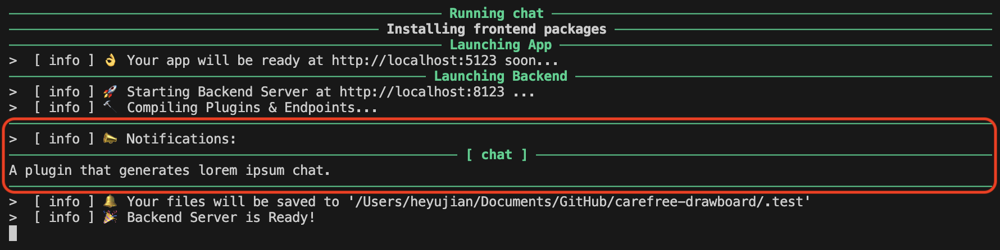

import Video from '@site/src/components/Video';

:::info API reference
* [IPluginInfo](/docs/api-reference/IPluginInfo)
  * [IChatPluginInfo](/docs/api-reference/IPluginInfo#ichatplugininfo)
:::

`IChatPlugin` is a (very) simple plugin binding for you to interact with a chat API (e.g., ChatGPT API), but it is pretty out of the box to use.

We've already provided a `test_chat.py` file in the `tests` folder, and here we will break it down for you to understand how `IChatPlugin` works.

Here's the complete code:

```python title="tests/test_chat.py"
import time

from cfdraw import *
from lorem_text import lorem


class ChatPlugin(IChatPlugin):
    notification = "A plugin that generates lorem ipsum chat."

    @property
    def settings(self) -> IPluginSettings:
        return IPluginSettings(
            w=600,
            h=400,
            useModal=True,
            tooltip="Pseudo Chat",
            pivot=PivotType.RIGHT,
            pluginInfo=IChatPluginInfo(
                closeOnSubmit=False,
                toastOnSubmit=False,
            ),
        )

    async def process(self, data: ISocketRequest) -> str:
        request = data.extraData
        context = request["context"]
        userInput = request["userInput"]
        if context:
            context += "\n"
        new_context = f"{context}\nYou: {userInput}\n\nBot: "
        text = lorem.words(20)
        for char in text:
            new_context += char
            self.send_progress(textList=[new_context])
            time.sleep(0.025)
        return new_context


register_plugin("chat")(ChatPlugin)
app = App()
```

## Imports

```python title="tests/test_chat.py"
import time

from cfdraw import *
from lorem_text import lorem
```

Nothing special, but notice that we import `lorem_text` so we can generate some random text later.

## Notification

```python title="tests/test_chat.py"
class ChatPlugin(IChatPlugin):
    # highlight-next-line
    notification = "A plugin that generates lorem ipsum chat."
```

By specifying the `notification` property, a notification will be logged to the console when the plugin is loaded.



## Styles

:::info API reference
* [IPluginSettings](/docs/api-reference/IPluginSettings)
:::

```python title="tests/test_chat.py"
class ChatPlugin(IChatPlugin):
    @property
    def settings(self) -> IPluginSettings:
        return IPluginSettings(
            # highlight-start
            w=600,
            h=400,
            useModal=True,
            tooltip="Pseudo Chat",
            pivot=PivotType.RIGHT,
            # highlight-end
            pluginInfo=IChatPluginInfo(
                initialText="Bot: Hello, can I help you?",
                closeOnSubmit=False,
                toastOnSubmit=False,
            ),
        )
```

These are common styles settings, and this line:

```python title="tests/test_chat.py"
class ChatPlugin(IChatPlugin):
    @property
    def settings(self) -> IPluginSettings:
        return IPluginSettings(
            ...,
            pluginInfo=IChatPluginInfo(
                # highlight-next-line
                initialText="Bot: Hello, can I help you?",
                closeOnSubmit=False,
                toastOnSubmit=False,
            ),
        )
```

Specifies the initial text of the chat.

:::note
We specified:

```python title="tests/test_chat.py"
class ChatPlugin(IChatPlugin):
    @property
    def settings(self) -> IPluginSettings:
        return IPluginSettings(
            ...,
            pluginInfo=IChatPluginInfo(
                initialText="Bot: Hello, can I help you?",
                # highlight-start
                closeOnSubmit=False,
                toastOnSubmit=False,
                # highlight-end
            ),
        )
```

Because we want users to be more engaged with the plugin, and don't want the plugin to be closed or toasted after the users submit their chats.
:::

## Logics

:::info API reference
* [ISocketRequest](/docs/api-reference/ISocketRequest)
* [Built-in Methods](/docs/api-reference/built-in-methods)
  * [send_progress](/docs/api-reference/built-in-methods#send_progress)
:::

In order to interact with the chat API, we (at least) need to get two things:

* `context`: The previous context of the chat.
* `userInput`: The latest user input.

Therefore, `IChatPlugin` injected them into the `extraData` property:

```python title="tests/test_chat.py"
class ChatPlugin(IChatPlugin):
    ...

    async def process(self, data: ISocketRequest) -> str:
        # highlight-start
        request = data.extraData
        context = request["context"]
        userInput = request["userInput"]
        # highlight-end
        if context:
            context += "\n"
        new_context = f"{context}\nYou: {userInput}\n\nBot: "
        text = lorem.words(20)
        for char in text:
            new_context += char
            self.send_progress(textList=[new_context])
            time.sleep(0.025)
        return new_context
```

With `context` and `userInput`, we should be able to send the corresponding data to the chat API and receive new responses. In this example, we simply generate some random text to mimic a chat API:

```python title="tests/test_chat.py"
class ChatPlugin(IChatPlugin):
    ...

    async def process(self, data: ISocketRequest) -> str:
        request = data.extraData
        context = request["context"]
        userInput = request["userInput"]
        if context:
            context += "\n"
        new_context = f"{context}\nYou: {userInput}\n\nBot: "
        # highlight-next-line
        text = lorem.words(20)
        for char in text:
            new_context += char
            self.send_progress(textList=[new_context])
            time.sleep(0.025)
        return new_context
```

What's more, we even use `time.sleep` to mimic the streaming process of the chat API. Also, we utilized the built-in `send_progress` method to make sure that as long as the (pseudo) streaming chat API responses a char / word, we can send it immediately to the drawboard 🎨 and ask it to refresh the chat:

```python title="tests/test_chat.py"
class ChatPlugin(IChatPlugin):
    ...

    async def process(self, data: ISocketRequest) -> str:
        request = data.extraData
        context = request["context"]
        userInput = request["userInput"]
        if context:
            context += "\n"
        new_context = f"{context}\nYou: {userInput}\n\nBot: "
        text = lorem.words(20)
        # highlight-start
        for char in text:
            new_context += char
            self.send_progress(textList=[new_context])
            time.sleep(0.025)
        # highlight-end
        return new_context
```

## Run

```bash title="tests"
cfdraw run --module test_chat.py
```

And here's a demo video of how this plugin works:

<Video url="https://github.com/carefree0910/carefree-drawboard/assets/15677328/4fb7f3e0-617c-4c5b-9a06-1c062b425e38" />
